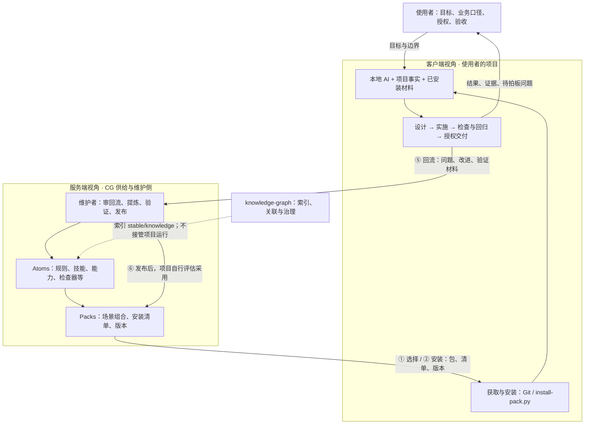

# CG 协作架构：先看整体，再看服务端与客户端

> 更新：2026-09-26 · 依据：本仓 `426a73d` 的源码与契约。本文是协作机制说明，不是在线部署状态报告。
>
> **[打开双视角交互图](collaboration-map.html)**：下载仓库后直接用浏览器打开，不需要安装依赖或启动服务。GitHub 上可继续阅读本文中的图表。

CG 负责提供可复用的协作方法与工具；项目中的人和 AI 负责理解现场、实施与验证。使用中发现的问题回到 CG，经维护者判断和发布，再由项目采用。人的目标和业务决定贯穿整个过程。

这里的“服务端视角”指 **CG 的供给与维护侧**，不表示必须有一台在线服务器。本仓目前可以通过 Git 和本地安装器完成分发；在线菜单是下游部署中观察到的另一条路径，其源码不在本次核对的公开仓中。

## 1. 整体架构



- **人**：决定目标、业务口径、权限范围与交付授权。
- **CG**：供给协作机制，决定回流是否适合通用化。
- **客户端**：AI 助手、宿主工具、本地材料和项目的组合；判断、实施与测试在这里发生。
- **现有业务系统**：仍是项目的数据或业务权威；CG 的规范包不会代替它作业务决定。
- **knowledge-graph / Desk**：分别负责上层知识治理、个人工作台入口等；本图不把这些职责转给 CG。

## 2. 六个环节，两端逐项对齐

| 环节 | 服务端视角：CG 做什么 | 客户端视角：项目做什么 | 交接内容 / 留下的证据 |
|:--|:--|:--|:--|
| ① 了解与选择 | 提供包说明、领域清单和已知边界 | 读本仓与使用者原话，选合适的包；未知明确写出 | 包名、已有能力、所需材料、尚无成品的领域 |
| ② 获取与安装 | 在仓库发布资产、安装清单和版本 | 获取指定版本，按安装清单落到本地，核对变更 | 安装文件、版本记录；不是“自动生效”证明 |
| ③ 接入与加载 | 提供规则入口、流程和已有宿主适配样例 | 把规则指针接入项目约定，核实宿主是否发现并加载 | 配置位置、实际调用入口；必要时手动运行 |
| ④ 实施与验收 | 已下载资产可离线使用；无需中央运行时逐次参与 | 写设计稿、做改动、跑检查和回归、按授权交付 | 产物、可重跑的验证结果、限制与业务待裁项 |
| ⑤ 问题与改进回流 | 维护者审核可复用性，决定接受、修改或暂不做 | 提交问题现象、改进内容、来源版本和验证材料 | Issue 或回流 PR；提交成功不等于已接受 |
| ⑥ 发布与再次采用 | 提炼为通用资产，验证后发布，更新说明 | 查看变更，评估并采用版本，重新核实加载与效果 | 新版本、采用记录、新一轮验证；不会自动升级所有项目 |

这六环是协作总流程。下文的在线菜单“五步”是其中的一条具体取用流程，两者不混作同一个执行状态机。

## 3. 服务端视角：供给、维护、发布

### 3.1 供给的是什么

| 材料 | 给使用者的作用 | 主要位置 |
|:--|:--|:--|
| Rule / 规则 | 工作时应遵守的边界与原则 | `stable/atoms/rules/`，或具体包的 `rules/` |
| Skill / 技能、Command / 入口 | 何时启动、按什么步骤完成一件事 | `stable/atoms/skills/`、`stable/atoms/commands/`、具体包 |
| Agent / Capability | 职责与能力分工 | `stable/atoms/capabilities/`、具体包 |
| Workflow / 流程 | 有状态的步骤、关卡、重试与完成条件 | `stable/packs/create-toolkit/` 中已实现的流程 |
| Validator / 检查器 | 对明确契约作机器检查 | `stable/atoms/validators/`、具体包的 `validators/` |
| Adapter / 宿主适配 | 把通用材料接到具体工具的入口和配置 | 具体包的 `adapters/`（例如 `create-toolkit/adapters/cursor/`） |
| Pack / 场景包 | 把兼容材料组织成可选择、可安装的组合 | `stable/packs/` |
| 知识与索引 | 解释方法及适用问题，供上层检索 | `stable/knowledge/index.yaml` |

具体包的发布和定制约定以它自己的契约为准。不要把“所有文件随便改”或“所有包一律不可改”当成跨包规则。

### 3.2 分发不等于远程运行

本仓的 `scripts/install-pack.py` 读取 `install-manifest.yaml`，把材料部署到清单允许的目标位置（例如 `.agents/`、`.cursor/`），并记录安装信息。它不替使用者接管整个工作区，也不替业务系统决策。

有些资产用于参考或稀疏检出，并非每个目录都有统一安装清单。应先看对应 README 和清单，不能由目录名字推断已具备安装能力。

### 3.3 回流由维护者判断

当前公开仓的正式回流路径见 [下游规范](downstream-spec.md)：

```text
实际使用 → 问题 / 改进 / 验证材料
  → Issue 或 .knowledge/downstream/pending/ 中的回流 PR
  → 维护者判断、提炼与验证
  → 接受并发布 / 要求补充 / 暂不做
  → 客户端评估采用
```

业务口径留给业务负责人；CG 维护者判断的是“能否成为通用协作资产”。本仓的回流文档与记录是流程依据，不能仅凭一个目录或空列表推断已有后台自动巡检在运行。

## 4. 客户端视角：拿到、用上、证明做对

### 4.1 三类本地输入

1. **使用者原话**：目标、口径、限制、授权。
2. **项目事实**：已有系统、权威数据、源码、文档、测试和现场材料。
3. **CG 材料**：规范、技能、设计稿模板、检查器与适配说明。

AI 助手把三者结合形成方案。没有依据的事实写“给不出”，没有授权的业务口径交给负责人。CG 包中某个行业的模式名不构成该项目的业务判据。

### 4.2 生效要分层证明

| 状态 | 需要看到的证据 | 不能据此推断什么 |
|:--|:--|:--|
| 已安装 | 文件与版本记录存在 | 宿主已经加载 |
| 已接入 | 配置写到实际读取的位置 | 配置一定被发现或信任 |
| 已加载 / 可调用 | 宿主或实际调用结果可验证 | 收工时一定自动触发 |
| 已触发 | 这一次事件确实执行了检查 | 检查覆盖了所有质量要求 |
| 检查通过 | 输出与退出状态符合检查器契约 | 页面一定好用、业务口径一定正确 |
| 验收通过 | 机器检查、交互验证、所需人工判断都有证据 | 自动获得额外发布或业务操作权限 |

特别是 hook（自动触发配置）：**配置存在、成功触发、检查通过**要分别核实。当前 `delivery-data-app v0.1.0` 随包提供 Claude Code Stop 配置样例；其他宿主不能只凭这份文件宣称自动触发已接通。没有自动触发证据时，可以执行并如实报告手动检查。

### 4.3 三种问题，三个去向

| 遇到的问题 | 处理 |
|:--|:--|
| 实现不符合已确认要求 | 修实现，重新验证 |
| 规范不合身、检查器误报 / 漏报、缺少组件 | 按该包的回流约定记录现象、位置、版本与证据；维护者判断通用修改 |
| 异常口径、可见范围、业务阈值尚未确认 | 留在项目的业务待裁记录中，等指定负责人决定 |

发布态包不要通过修改检查器或忽略失败制造“通过”；需要适配时按包契约处理，并保持检查语义。

## 5. 在线菜单：已观察到的扩展路径

> **状态边界**：下游环境提供过在线 `domain-menu v0.2` 客户端及回执。`426a73d` 的公开仓只有包内 `domain-menu v0.1` 静态领域清单，没有该在线客户端或菜单服务实现。本节描述已观察的接口协作方式，不能作为“克隆本仓即可运行菜单服务”的承诺；也没有在此实现或部署服务。

在线菜单的五步是：**拿清单 → 本仓自查 → 交回 → 按回执做 → 过几天查编号**。本仓自查和类型选择发生在客户端；该已观察版本的服务按类型查表、给材料或登记缺口。

| 交互 | 客户端给出 | 服务端返回 / 作用 |
|:--|:--|:--|
| `packs` / `checklist` | 读取请求 | 包目录、版本；问题、类型表、答案模板 |
| `submit` | 类型、答案、选定材料；附项目名、已装包版本 | 总回执；有包则给包和设定，缺口则给编号及可提供的骨架 / 材料指引 |
| `install` | 要取用的包名 | 下载材料；客户端校验、安装并记录版本 |
| `feedback` | 类别、位置、现象；附项目与包版本 | 登记编号；登记不等于接受或修复 |
| `status` | 票据编号 | 状态、说明、关联包 |
| `resend` | 离线时暂存的提交 / 反馈 | 恢复连接后补交并取得回执 |

这个版本的客户端提交的是填写到答案中的内容，不会自动上传整个项目仓库。填写前仍须选择适合回流的材料；凭据仅作身份验证，不能混入答案、源码和公开文档。

离线策略也要分层：已装材料可继续本地用；需要联网的取包和查询可能失败；已观察客户端会暂存连通失败的提交 / 反馈。如果任务明确要求“起步连不上就停止”，应先遵守该任务的具体约定。

本次提交不包含真实项目名、员工数据、业务原话、真实票据或本机路径。示例中的“回执”和“编号”是机制概念。

## 6. 现状、验证与后续

| 项目 | 本文确认到的状态 | 依据 |
|:--|:--|:--|
| CG 供给 / 本地运行 / 回流的职责边界 | 本仓契约明确 | [AGENTS.md](../AGENTS.md) |
| Pack 安装与记录 | 有实现与测试 | [安装器](../scripts/install-pack.py)、[测试](../scripts/tests/test_install_pack.py) |
| 数据应用包 | 公开仓版本 0.1.0 | [安装清单](../stable/packs/delivery-data-app/install-manifest.yaml) |
| 领域清单 | 公开仓是静态技能 | [技能](../stable/packs/delivery-data-app/skills/domain-menu/SKILL.md) |
| 数据应用检查器 | 有机器检查，也有人工判断边界 | [包说明](../stable/packs/delivery-data-app/README.md)、[检查器契约](../stable/packs/delivery-data-app/validators/data-app-norms-check/CONTRACT.md) |
| 在线菜单及票据机制 | 下游观察，公开仓未含实现 | 本文第 5 节；后续需维护侧提供对应源码 / 发布入口再核对 |
| 后台自动处理反馈、自动升级全部客户端 | 未在本次核对中证明 | 不能从流程图推断已运行 |

交互图是本文的阅读入口：初始总图和两端分工始终可见，六个交互环节可展开，具体源码和规范可继续点击。页面使用本地 HTML/CSS/SVG 和浏览器原生展开控件，没有联网请求、远程字体或运行时依赖。

验证方式：在浏览器打开 `docs/collaboration-map.html`，确认离线可读、键盘可展开、源码链接可达，并在 390px 与 320px 宽度检查没有横向溢出。规范检查可在仓库根目录运行：

```bash
python stable/packs/delivery-data-app/validators/data-app-norms-check/scripts/check_data_app_norms.py docs/collaboration-map.html
```

这条命令只验证检查器覆盖的规则；不能据此宣称全部交互和业务内容都已验证。

原始 2026-02-25 架构设计保留在 [历史快照](history/architecture-2026-02-25.md)，其中当时的数量、状态与路线图不再作为当前状态。
