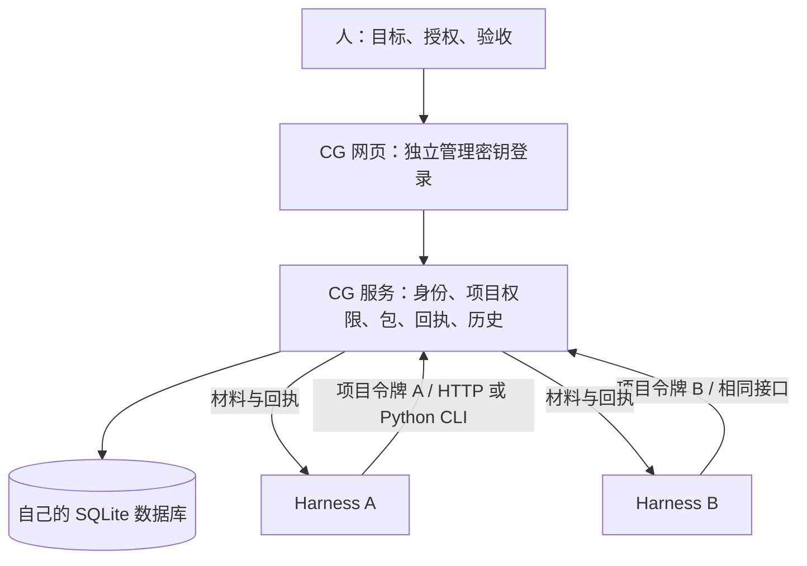

# CG 独立身份与多 harness 接入

## 1. 问题与目标

用户明确要求：外置系统不绑定 ChatGPT，以后接入多种 harness。上一版直接从平台用户头取得 CG 所有者，导致网页和命令行入口受平台登录限制。本次让 CG 独立运行，人的管理入口和 harness 项目令牌共用同一套服务与记录。

## 2. 使用者与边界

当前是单个维护空间：维护者登录处理请求；不同 harness 持有各自的项目令牌，提交、查询和回写证据。每个令牌可单独撤销，名称只是说明，不授予权限。多租户注册、OAuth/OIDC、各宿主专用插件不在本次范围。CG 仍是可选的材料与回执服务，不接管本地 harness 的执行循环。

## 3. 整体与双视角设计

服务端视角：Node HTTP 服务验证独立管理密钥，签发短期 HttpOnly 会话；接口核心只接收服务端验证后的 principal，忽略所有客户端身份头。客户端视角：浏览器登录；harness 用项目令牌访问 `/v1/`。宿主名称不参与任何身份或权限判断。

## 4. 实现与不变量

- 独立启动入口强制配置公共 origin 和管理密钥摘要文件。HTTP 仅允许回环开发地址；外部使用 HTTPS 反向代理，服务不相信转发身份头。
- 随机生成 256 位管理密钥，只显示一次；配置只存摘要。会话在内存中保存摘要，8 小时过期，退出立即撤销，服务重启要求重新登录。令牌、回执和历史仍持久化。
- 本机入口仍只监听回环地址，保留现有本机记录；独立服务默认使用同一 `local-owner` 维护空间。线上旧平台数据不自动合并，不隐式转换所有者。
- 所有页面零外部资源依赖；业务判据、包安装器与原有请求幂等不变；浏览器不保存管理密钥到 localStorage；任意头不能伪装已登录用户。
- 同项目的不同 harness 可接力处理同一条记录；不同项目令牌隔离；harness 不能创建密钥或执行维护者操作。

## 5. 验收

构建后运行 `node --test service/tests/*.test.mjs`、`python -m unittest discover -s scripts/tests -q` 和 `python stable/packs/delivery-data-app/validators/data-app-norms-check/scripts/check_data_app_norms.py web/index.html web/login.html docs/collaboration-map.html`。

新增真实 HTTP 验证：无凭据、伪造平台头被拒绝；独立网页登录、退出、会话过期；两个 harness 对同一项目提交/查回执/留证据；跨项目拒绝；撤销仅影响对应令牌；真实 Python CLI 在无平台身份时接入；重启后记录与令牌仍有效。规范呈现要求“动作后有回执”和结构要求“空状态解释原因与下一步”适用于登录成功、失败和项目接入列表。

## 6. 交付与部署

提交代码、部署说明、反向代理与容器示例；默认构建不要求 Sites 配置。历史 Sites 配置仅保留供已有部署识别，不把旧地址当独立版地址，不自动扩大受众。用户尚未指定独立服务器或域名，完成可运行交付后如实说明线上迁移尚未进行。

### 本次验证结果

- Node 服务与交互：11 项通过，0 失败，包括独立身份与多 harness 接力。
- Python 原回归和客户端：19 项通过，0 failed/error。
- 页面规范：工作台、登录页、架构页 3 页通过，0 FAIL。
- Docker：基于实现提交 `df0c30e7a2a2ba2b7cd63f64034b848e2a1190a8` 构建镜像，在 Linux ARM64 非 root 容器中确认独立登录、项目令牌、提交、重启后旧会话失效且令牌和记录保留。验证资源已清理。
- 不宣称：真实公网域名 / TLS 已部署、旧 Sites 数据已迁移、每个 harness 的专用插件已验证、多尺寸浏览器视觉验收已完成。
