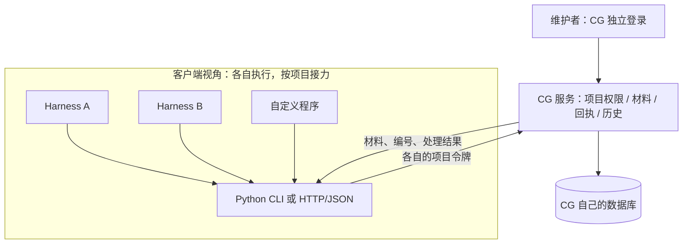

# Harness 接入契约 v1

CG 服务不区分模型供应商或 harness 品牌，不远程接管 agent 执行。HTTP/JSON 是公共契约；Python CLI 是一个标准库参考客户端；浏览器 WebMCP 是可选交互增强。接入不要求 ChatGPT 或其他平台账号。



## 连接与权限

### 项目令牌是什么，怎样分配

项目令牌是一段随机生成的接口访问凭证，相当于发给某个接入的钥匙。这里的 token 不代表模型计费额度。CG 根据它识别维护空间、允许访问的项目和操作来源。

当前权限分为两层：维护者用管理密钥登录 CG 网页，可以签发 / 撤销令牌、处理请求；harness 用项目令牌，只能在指定项目内提交、查结果、追加证据和撤回请求。

建议按“项目 × 接入实例”签发，同一个项目可以有多个令牌。以下名称只是示例，不会自动创建接入：

| 项目 | 接入名称 | 单独签发的令牌 | 记录范围 |
|---|---|---|---|
| 菜吉弟 | Codex · 日常开发 | A | 菜吉弟的全部协作记录 |
| 菜吉弟 | Cursor · 日常开发 | B | 同一份菜吉弟记录，可以接力 |
| 菜吉弟 | 自动检查脚本 | C | 同一份菜吉弟记录 |
| 另一个项目 | Codex · 开发 | D | 另一个项目的记录 |

A、B、C、D 表示不同凭证，不是真实密钥。撤销 A 不影响 B、C、D。一个凭证若复制给多个程序，CG 只能知道它们使用了同一把钥匙，无法证明实际是哪种 harness 执行了动作；接入名称只是备注，不是宿主身份认证。

创建时由维护者填写项目名和接入名称，CG 生成随机令牌。完整令牌只返回一次，服务仅存摘要。把服务地址和对应令牌放到该接入的秘密配置中；遗失后重新签发，停用时单独撤销。无需给每次对话、每个临时子任务或每个模型再发一把；需要分开追踪或撤销时再拆分。

**当前边界**：项目以维护空间内的项目名精确匹配，尚无独立项目 ID、重命名流程或项目成员表。同项目令牌具有相同的客户端权限，能读该项目全部协作记录，也能撤回同项目其他接入提交的请求。尚无只读令牌、自动到期、最后使用时间或令牌级操作范围；自动检查脚本在此例中也未获得单独的只读角色。不同环境若需数据隔离，应使用不同项目名或独立实例，仅改接入名称不会隔离数据。令牌不授予本地文件、GitHub 仓库、模型账号或业务后台权限，这些由各自系统控制。

### 客户端配置

- `CG_MENU_URL`：自己的 CG 根地址，生产环境 HTTPS。
- `CG_MENU_TOKEN`：为当前 harness 签发的项目令牌；保存在宿主的秘密配置中，不写入项目仓库。
- HTTP 认证：`Authorization: Bearer <项目令牌>`；写请求使用 `Content-Type: application/json`。命令行不需要 cookie。
- 项目名必须与令牌授权完全相同。令牌只可提交、读取、追加证据和撤回该项目的请求；不能处理维护状态或签发其他令牌。
- 每个 harness 应持有不同令牌，即使对应同一个项目。`label` 是维护者填写的名称，不是授权信息。记录中的 actor 是服务验证后的令牌编号。

## 一次交接

1. `GET /v1/checklist` 取得问题、类型及答案模板；`GET /v1/packs` 取得实际发布目录。
2. `POST /v1/requests` 交自查；`client_request_id` 在发出前保存，并在失败重试时复用。
3. 读取回执中的 `request_id`、`results[].ticket`、包和缺口说明。下载之后仍需本地安装、加载和验证。
4. `GET /v1/tickets/:id` 查询处理结果；其他 harness 用同项目自己的令牌可接着读这条记录。
5. `POST /v1/tickets/:id/evidence` 提交 `{ "stage": "checked", "detail": "实际命令、结果与证据位置" }`。
6. 规范问题用 `POST /v1/requests`，`kind: "feedback"`、`category: "misfit" | "validator" | "want"`，带 `project`、`text`、`where`、`client_request_id`。

自查请求例子（答案必须来自实际项目；不知道写“给不出”）：

```json
{
  "project": "项目名",
  "client_request_id": "持久保存的唯一标识",
  "kind": "solution",
  "types": ["data-app", "retail-multistore"],
  "answers": {
    "systems": "给不出",
    "users": "给不出",
    "objects": "给不出",
    "authority": "给不出",
    "goal": "给不出",
    "materials": "给不出"
  },
  "installed": {}
}
```

真实接入先从 `checklist` 的模板开始，用实际材料替换示例，避免手抄过期字段。Python 参考客户端示例：

```sh
python scripts/menu.py checklist
python scripts/menu.py submit /tmp/answers.json
python scripts/menu.py status T-回执编号
python scripts/menu.py evidence T-回执编号 --stage checked --text '实际结果与证据位置'
```

## 错误与重试

401：缺少令牌、令牌无效或被撤销；重新向维护者取得项目令牌，不尝试登录模型平台。403：项目或操作越权。404：记录不存在或无权读取。409：提交标识冲突或记录已更新；对同一次提交保持相同内容和标识，编辑后的新提交使用新标识。429：按照 Retry-After 等待。网络失败时保留待提交内容，CLI `resend` 会沿用标识并限制为原服务地址。

一次请求成功只代表服务收到材料，不代表已经安装、加载、触发或验收。服务保存执行者报告的证据，不伪造独立检查结论。多 harness 的接力也不绕过项目自身的人类审批或业务口径。
