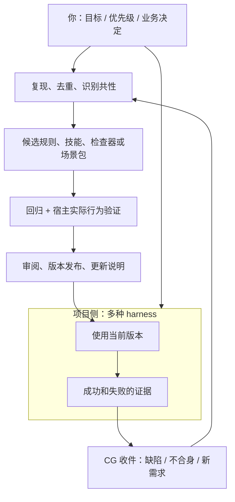

# CG 维护与丰富方案

> 盘点日期：2026-09-26。依据：`a2e0f30` 的仓库内容及本轮文档修订。本文区分已实现、仓库已有但本轮未验证、后续建议；不是自动运行的维护服务，也不把待办写成已交付。

## 维护目标与分工

CG 要持续提供可复用的人—Agent 协作材料，允许不同 harness 消费，并从真实项目回流改进。维护包含两条线：让已有能力保持可靠，和把经过验证的项目经验转成通用能力。

使用者提供真实问题、选优先级、确定业务口径与推广范围；维护 Agent 负责盘点、复现、提炼、实现、回归和准备可审阅交付；项目里的 harness 执行材料，回传结果和失败证据。CG 不统一宿主账号、沙箱或审批，不接管 harness 的执行循环，不替上层 knowledge-graph 管理跨域治理。



## 当前盘点：事实和缺口

| 层次 | 当前可核对的事实 | 接下来应补的维护能力 |
|---|---|---|
| 通用资产 | `stable/atoms/`、`stable/packs/`、知识索引已有规则、技能、模式和包 | 明确每项的作者源、版本、适用条件、验证日期及依赖；不能因位于 stable 就推断所有宿主已验证 |
| 分发 | 在线构建白名单明确提供 `delivery-data-app`、`second-loop-compounding`；其他源码包有各自安装方式 | 发布目录、安装清单和知识索引的一致性检查；同版本不能悄悄改变发布内容 |
| 跨宿主 | 已有 `cross-host-thin-adapters` 清单；其中的验证状态带历史日期；项目令牌 HTTP/CLI 接力已验证 | 按宿主和版本复验发现、加载、触发、检查；HTTP 可接通不等于技能或 hook 已生效 |
| 工作台 | 独立登录、项目令牌、反馈、回执、历史和证据已实现 | 稳定项目 ID、权限范围、令牌有效期、使用记录；公网部署与备份恢复演练 |
| 下游回流 | 已有两个已提交的回流目录；`backflow.yaml` 的 pending/processing 为空，completed 仅有旧条目 | 核对登记与源码/PR状态，不由目录名推断“仍待审核”或“已正式发布” |
| 上游上报 | `scripts/backflow.sh` 处理的是 CG → knowledge-graph 的 exports | 与下游 → CG 收件分清；脚本包含写文件与推送动作，不能拿它冒充只读巡检或下游收件处理 |
| 接入工具 | 已有 `scripts/mcp-server.py`，主要暴露本仓能力目录 / 安装入口 | 先审计现有工具，决定是否增加工作台回执工具；本轮未运行其外部依赖，也未证明其端到端兼容 |
| 验证 | Node、Python、页面检查和独立容器有本轮验证记录 | 仓库当前没有 `.github/workflows/`；应将已有检查变成可重复的统一入口，再接 CI |

依据：[项目定位](../AGENTS.md)、[发布构建](../scripts/build-pack-catalog.py)、[宿主适配快照](../stable/packs/harness-engineering/skills/cross-host-thin-adapters/SKILL.md)、[回流登记](../.knowledge/downstream/backflow.yaml)、[回流目录](../.knowledge/downstream/pending/README.md)、[上报脚本](../scripts/backflow.sh)、[现有 MCP](../scripts/mcp-server.py)。

## 维护节奏：按事件推进

| 触发时机 | 维护动作 | 留下的产物 |
|---|---|---|
| 开始一轮维护 | 更新仓库、确认工作区，读取现行约定和上轮未结项；只核对本轮涉及的源 | 盘点日期、基线版本、准备处理的任务 |
| 项目用完材料 | 收集问题、上下文、版本、失败现象与可公开的证据；业务原始数据留在项目侧 | 可复现反馈、候选改进；没有证据就标待验证 |
| 修一个问题 | 先复现，找作者源，检查重复副本，修改并运行对应回归 | 修复、验证记录、适用范围 |
| 准备新增能力 | 先找现有能力能否覆盖，说明为什么需要新增，做最小试点 | 候选材料、实际使用证据、反例与限制 |
| 准备发布 | 对齐源文件、版本、索引、下载目录、变更说明和迁移说明；验证安装路径 | 可识别版本、校验摘要、适用宿主、验证日期 |
| 宿主升级或接入失败 | 重新验证受影响的发现、加载、事件触发与工具权限 | 更新兼容矩阵；失败则标未验证 / 不兼容，保留手动替代路径 |

这些是执行每轮任务时的步骤。本轮没有设置定时任务，也不声称会在会话结束后自行持续运行。

## 下一批任务与完成标准

顺序是本次建议，可由使用者按实际痛点调整。只有“本轮完成”项代表已修改；其余均是待办。

| 顺序 | 任务 | 完成标准 | 状态 |
|---|---|---|---|
| 0 | 解释令牌分配、权限与已有边界 | 示例与代码一致，明确同项目共享范围、接入名称不授权、没有自动到期 | 本轮完成，见 [令牌说明](harness-api.md#项目令牌是什么怎样分配) |
| 0 | 修正文档中的下游回流入口 | 模板路径真实存在，目录约定一致，不承诺不存在的 review/accept 命令 | 本轮完成，见 [下游说明](downstream-spec.md) |
| 1 | 建立统一验证入口与 CI | 干净检出后能构建并跑现有回归；失败阻止发布；输出版本与结果 | 待办 |
| 1 | 资产与索引一致性检查 | 找出失效路径、缺安装源、版本不一致；错误可复现，不以改检查器掩盖资产问题 | 待办 |
| 1 | 回流登记与工作台对齐 | 历史目录关联实际 PR / 结果；工作台反馈可形成脱敏回流包，保留来源编号与人工审核 | 待办 |
| 2 | 先完成两种实际 harness 的最小接入 | 各自执行一次取清单、加载材料、触发检查、交证据；记录版本和失败路径，不能只更改 label | 待办，具体宿主按使用者实际环境选择 |
| 2 | 补项目与凭证生命周期 | 稳定项目 ID、重命名兼容、可选到期时间、操作范围、使用记录；老令牌有迁移路径与隔离测试 | 待办，先确认多人/多环境需求 |
| 2 | 独立线上部署与恢复演练 | 自己的地址可访问，TLS、秘密配置、持久化、备份还原均实际验证 | 待办，部署位置未指定 |
| 3 | 丰富领域材料 | 先从一个真实项目问题提炼模板、边界与测试；通过试点后再发布 | 待办 |

统一验证入口应复用现有命令，不另造通过标准：

```sh
pnpm install --frozen-lockfile
pnpm build
pnpm test
python -m unittest discover -s scripts/tests -q
python stable/packs/delivery-data-app/validators/data-app-norms-check/scripts/check_data_app_norms.py web/index.html web/login.html docs/collaboration-map.html
```

扩展 CI 时按变更范围补上所改 Validator 自己的测试；不要把这组工作台检查当作所有 stable 资产的完整认证。宿主实际行为和公网部署分别需要相应证据。

## 怎样丰富内容

优先丰富能被重复使用的机制，而不是只增加文件数。

1. **跨 harness 接力**：从现有 HTTP 接口、Python 客户端与薄适配清单出发，补材料加载、会话交接、执行证据和失败恢复的实际样例；各宿主权限维持各自边界。
2. **交付质量**：围绕现有数据应用包补真实失败样例，尤其是脚本渲染的列表、筛选、空态、回执和手机布局。静态 HTML 检查无法证明完整交互，必要时增加针对行为的验证。
3. **维护与发布**：把复现、候选材料、版本变化、迁移、回滚和采用效果串起来，让下一次维护能从证据继续。
4. **零售领域**：可从用户已提出的门店、员工、单据场景提炼通用对象、权限待确认项和验收模板。业务异常阈值、谁能看谁、老板规则仍留给项目负责人；没有真实材料时不把骨架升级为成品包。

候选材料至少带“解决什么、来源、适用边界、如何使用、如何验证、已知失败”六项。先放候选或回流区，经过验证和审阅再进入发布目录。私有项目事实不能因为回流而自动成为公开素材。

## 怎么判断维护有效

跟踪：实际复现并解决的问题、回流到发布的周期、逐宿主通过的接入路径、过期/失效资产、升级失败与回退、发布后项目是否真正在用。当前没有统一采集这些指标，不能从文件数、下载数或令牌数推断有效采用。

一次维护结束应能回答：改了什么、依据是什么、在哪里验证、是否发布、谁还需要作决定。保持 `已安装 → 已接入 → 已加载 → 已触发 → 检查 → 验收 → 交付` 的证据区别，避免把“有文档”当作“已经生效”。
